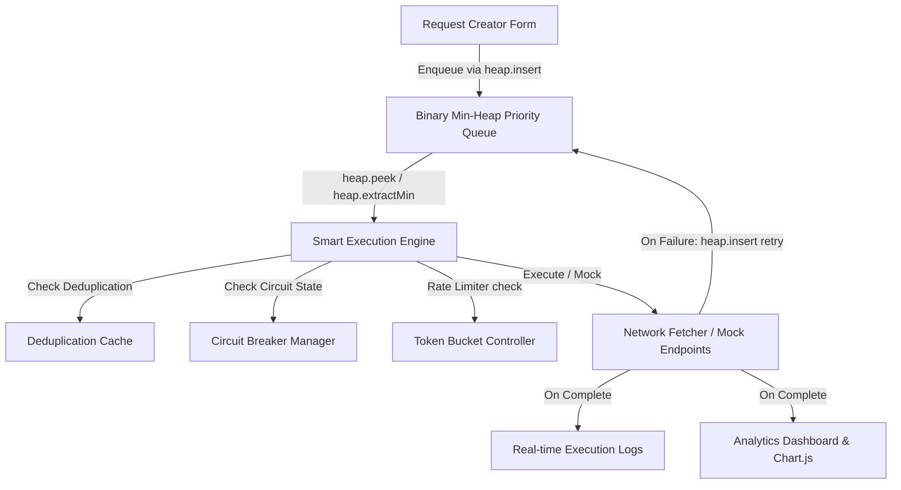

"python -m http.server 8085" run code
"http://localhost:8085"python -m http.server 8085

# Implementation Plan — Binary Min-Heap Smart API Request Management System

A premium, fully-interactive Single Page Application (SPA) that simulates a queue-based Smart API Request Management System. The application showcases real-time API queue management via a **Binary Min-Heap Priority Queue** as the main data structure, with supporting systems: concurrent request processing, response inspection, rate limiting (Token Bucket), exponential backoff retry, request deduplication, and circuit breakers.

## User Review Required

> [!IMPORTANT]
> The entire application runs directly in the browser as a rich client-side SPA.
> Requests are managed using a **Binary Min-Heap Priority Queue** (`MinHeapPriorityQueue` class in `app.js`).
> The heap guarantees O(log n) insertion, O(log n) extraction, and O(1) peek — no Array.sort() is used for priority management.
> A mock network simulator mimics various endpoint behaviors while also allowing real `fetch` calls to external APIs.

## Architecture

```
API Requests
      ↓
Binary Min-Heap Priority Queue  ← MAIN DATA STRUCTURE (O(log n) insert/extract, O(1) peek)
      ↓
Smart Execution Engine
      ↓
Deduplication Check
      ↓
Circuit Breaker Check
      ↓
Token Bucket Rate Limiter
      ↓
API / Mock Network
      ↓
Response
      ↓
Analytics + Logs
```

## Complexity Analysis

| Operation | Complexity | Mechanism |
|---|---|---|
| Heap Insertion | O(log n) | _siftUp — bubble inserted node upward |
| Peek Highest Priority | O(1) | heap[0] — root is always minimum |
| Heap Extraction | O(log n) | _siftDown — restore after root removal |
| Remove Arbitrary | O(n) | linear find + O(log n) heapify |
| Priority Update (reheapify) | O(log n) | sift-up then sift-down |
| Space | O(n) | array-backed binary tree |

## Why Binary Min-Heap?

**Problem**: API requests have different priorities. The system must frequently select the highest-priority waiting request.

**Comparison**:
- **FIFO Queue**: Insert O(1), removal O(1) — cannot prioritize requests.
- **Sorted Array** (old implementation): Insertion required O(n log n) sort; frequent priority changes are expensive.
- **Binary Min-Heap** (new implementation): Insert O(log n), Extract O(log n), Peek O(1), Space O(n) — optimal for a priority queue.

## Priority Rules

| Priority Number | Label | Meaning |
|---|---|---|
| 1 | CRITICAL | Executed first (smallest heap value = root) |
| 2 | HIGH | — |
| 3 | MEDIUM | — |
| 4 | LOW | Executed last |

Tie-break: earlier `enqueuedTime` wins (FIFO within same priority tier).

## Proposed Changes

We built this project in the workspace directory `d:\Documents\DS_CSA0306`. It consists of:
- `index.html`: HTML structure including modern layouts, icons, font imports, and container panels.
- `style.css`: Modern dark glassmorphic theme, custom charts, animated states, and responsive layout.
- `app.js`: Client-side logic implementing the **Binary Min-Heap Priority Queue**, execution engine (handling concurrency, rate-limits, retries, circuit breakers, and deduplication), mock servers, Chart.js integrations, and DOM interactions.

### UI & Engine Architecture



---

### UI Components

#### [MODIFY] [index.html](file:///d:/Documents/DS_CSA0306/index.html)
- Modern layout with sidebar navigation (Queue Manager, Request Processor, Analytics Dashboard, Circuit & Settings).
- **Request Creator**: Form to customize mock or real API requests (Method, Endpoint, Headers, Priority: Critical/High/Medium/Low, Retry policy, Deduplication check).
- **Active Queue Visualizer**: Interactive list showing heap contents in priority order, with priority tags, status badges (Waiting, Running), and control buttons (Change Priority — calls `heap.updatePriority()`, Remove — calls `heap.remove()`, Run Immediately — calls `heap.remove()` then execute).
- Updated subtitle: `"Managed by Binary Min-Heap Priority Queue (O(log n) insert/extract)"`.
- **Execution Grid**: Real-time worker slots with progress bars and connection animations.
- **Log Panel**: High-performance streaming console logging `[HEAP]` events: insertions, extractions, priority updates, retry re-insertions.
- **Response Modal**: Full response viewer — headers, JSON body, response time, size, status badges.
- **Analytics View**: Response code distribution, queue size timeline (heap size), and per-endpoint latency bars using Chart.js.

#### [MODIFY] [app.js](file:///d:/Documents/DS_CSA0306/app.js)
- **`MinHeapPriorityQueue` class** (new): Binary Min-Heap with `insert`, `peek`, `extractMin`, `remove`, `updatePriority`, `contains`, `toSortedArray`, `isEmpty`, `size`, `clear`.
- **`priorityQueue`** (new): Global instance replacing `let queue = []`.
- **`enqueueRequest`**: Uses `priorityQueue.insert(req)` instead of `queue.push` + `queue.sort`.
- **`engineTick`**: Uses `priorityQueue.peek()` and `priorityQueue.extractMin()` — no array iteration.
- **`handleRequestFailure`**: Uses `priorityQueue.insert(req)` for retry — no `queue.unshift` + `queue.sort`.
- **`adjustPriority`**: Uses `priorityQueue.updatePriority(id, newPriority)` — no `queue.sort`.
- **`runImmediately`**: Uses `priorityQueue.remove(id)` — no `queue.splice`.
- **`deleteQueuedItem`**: Uses `priorityQueue.remove(id)` — no `queue.splice`.
- **`renderQueueList`**: Uses `priorityQueue.toSortedArray()` for display (rendering only, not extraction).
- **`updateUI` / `updateMetricsTick`**: Uses `priorityQueue.size()` instead of `queue.length`.
- **`[HEAP]` log messages**: All heap operations emit `[HEAP]` log events for demonstration visibility.

#### Supporting Smart Controllers (unchanged):
- *Token Bucket Rate Limiter*: Restricts outbound request rate.
- *Smart Retry with Exponential Backoff*: Failed requests re-inserted into heap with original priority.
- *Circuit Breaker*: Trips if failure threshold is reached; fail-fast intercepted via `heap.extractMin()`.
- *Deduplication*: Detects duplicate GET requests via `heap.contains()`.
- *Analytics & Chart Controller*: Real-time Chart.js bindings.

---

## Mock Endpoints (unchanged)

- `/api/users` — Fast response (150–350ms, 200 OK)
- `/api/heavy` — Slow computation (1200–1700ms, 200 OK)
- `/api/flaky` — 50% failure rate (500 Internal Server Error)
- `/api/rate-limit` — Token bucket endpoint (429 if >5 requests per 10s)
- `/api/payment` — Auth required (401 Unauthorized if no token)

---

## Verification Plan

### Source Code Verification
- Zero occurrences of `queue.sort()` in `app.js`.
- Zero occurrences of `queue.push()` / `queue.unshift()` / `queue.shift()` for priority management.
- `MinHeapPriorityQueue` class present with `_siftUp` and `_siftDown` methods.

### Manual Verification
1. Launch local server: `python -m http.server 8085` → open `http://localhost:8085`.
2. Add requests with priorities 1, 2, 3, 4 — verify priority 1 executes first.
3. Add two requests with same priority — verify FIFO (earlier `enqueuedTime` runs first).
4. Change priority via ▲/▼ buttons — verify heap reheapification (see `[HEAP]` log).
5. Test retry reinsertion — `[HEAP]` log shows retry re-inserted with correct priority.
6. Test deduplication — duplicate GET marked DEDUPLICATED, not added to heap.
7. Run traffic burst — critical (Priority 1) executes before medium/low.
8. Verify max 3 concurrent workers at all times.
9. Verify rate limiting throttles when token bucket empty.
10. Verify circuit breaker trips and recovers via HALF-OPEN.
11. Verify analytics charts and execution history update correctly.
12. Check browser console — zero JavaScript errors.
